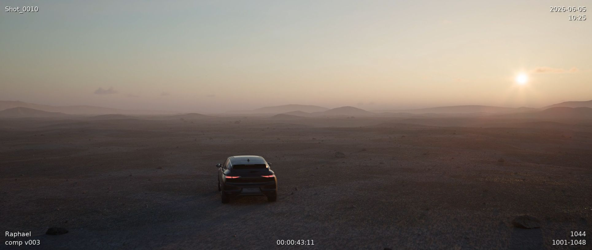

# daily

**EXR sequence → display-referred QuickTime movies for VFX dailies.**

`daily` is a command-line tool that converts linear-light EXR frame sequences into review-ready video clips, applying a full ACES colour pipeline via OpenColorIO and encoding to your codec of choice through FFmpeg.



---

## Inspiration

This project draws inspiration from [jedypod's `generate-dailies`](https://github.com/jedypod/generate-dailies).

`daily` is a reimagining of that idea with a narrower dependency footprint: no OpenImageIO, no compiled image libraries beyond the lean `OpenEXR` Python bindings.

---

## Features

- **ACES colour pipeline** — full OpenColorIO integration; configure any transform type (`colorconvert`, `display`, `look`) against any OCIO config. The tool is ACES-version-agnostic: ACES 1.x (including 1.3) and ACES 2.0 are equally supported — point `ocio.config` at the right `.ocio` file and set the colorspace/view names to match
- **Minimal dependencies** — EXR reading is handled by the `OpenEXR` Python package; no OpenImageIO required
- **Cross-platform** — runs on Windows, macOS, and Linux
- **Multi-batch encoding** — pass a directory, a single file, or a glob pattern (`shots/**/*.exr`); `daily` discovers all EXR sequences automatically, grouping frames and handling same-named sequences across subdirectories
- **SMPTE timecode** — derived from the absolute frame number and frame rate, optionally burned into the image and embedded in the container header
- **Multithreaded frame processing** — a `ThreadPoolExecutor` processes frames in parallel (defaults to CPU core count); configurable via `--output-threads`
- **Slate** — prepend any image (PNG, JPG, EXR) for a configurable number of frames before the sequence begins
- **Advanced text overlays** — 9-anchor positioning system, per-element font/size/colour/shadow; supports static elements (date, frame range, sequence name) and per-frame dynamic elements (timecode, frame counter, filename, EXR metadata fields, or any custom key injected at the command line)
- **Codec presets** — H.264 HQ/LQ, H.265, ProRes HQ/4444/Proxy, DNxHR HQX/SQ — all fully configurable in `codecs.yaml`
- **Rich progress UI** — live progress bar and structured logging via `rich`

---

## Requirements

- **Python 3.10+**
- **FFmpeg** — must be available on your `PATH`, or set the explicit path via `--ffmpeg` / the `ffmpeg:` key in `daily.yaml`
- **OCIO config** — set the `$OCIO` environment variable to the path of your `.ocio` file before running, or specify it in `daily.yaml`

```bash
export OCIO=/path/to/aces_1.3/config.ocio   # macOS / Linux
$env:OCIO = "C:\ocio\aces_1.3\config.ocio"  # Windows PowerShell
```

---

## Installation

```bash
# 1. Create and activate a virtual environment
python -m venv .venv

# macOS / Linux
source .venv/bin/activate

# Windows
.venv\Scripts\activate

# 2. Install daily and its dependencies
pip install .
```

`opencolorio` and `OpenEXR` ship as pre-built wheels on PyPI for most platforms (Windows, macOS, Linux x86-64), so no separate compilation step is needed.

---

## Example

A self-contained example lives in `example/` — EXR sequence, OCIO config, and slate frame are all included. `config/daily.yaml` is pre-configured to point at them, so a single command is enough. To encode as ProRes HQ with a custom artist tag instead:

```bash
daily -i example/input/**/*.exr -o example/output/ --slate-enable --text user="Raphael" --text description="comp v003"
```

---

## Processing Pipeline

Each EXR sequence is processed frame-by-frame through a fixed operation chain before being handed to FFmpeg:

```
EXR file
   │
   ▼
1. Read   ── OpenEXR bindings extract RGB channels as float32 numpy arrays.
              The display window / data window mismatch (overscan) is
              optionally trimmed to the display window.
   │
   ▼
2. OCIO   ── The linear-light float32 image is colour-transformed via
              OpenColorIO (e.g. ACEScg → sRGB display). The result is a
              display-referred image, still in float32.
   │
   ▼
3. Resize ── The image is scaled to the target output resolution using
              Pillow LANCZOS resampling. If the source aspect differs from
              the output, the content is centred with black letterbox bars.
   │
   ▼
4. Cropmask── Optional semi-transparent dark bars are composited over the
              image to enforce a cinema aspect ratio (e.g. 1.85:1) without
              actually cropping pixels.
   │
   ▼
5. Text   ── Static elements (date, sequence name, frame range) are rendered
              once per sequence. Per-frame dynamic elements (timecode,
              frame counter, filename, EXR metadata, custom CLI keys) are
              composited on every frame with shadow support.
   │
   ▼
6. Encode ── Processed frames are packed as rgb48le (16-bit/channel) and
              piped into an FFmpeg subprocess. The configured codec preset
              produces the final .mov / .mp4 file. SMPTE timecode is
              embedded in the container header.
```

If a slate is configured, the slate image is fitted to the canvas (with letterboxing) and inserted before the sequence frames. Text overlays are intentionally suppressed on the slate; only the EXR frames carry them. An optional `ocio_transform: true` flag in `daily.yaml` applies the same colour pipeline to the slate, which is useful when `frame_path` points to a linear EXR rather than a display-referred PNG.

Steps 1–5 run concurrently in a thread pool. Each worker processes a chunk of frames and delivers ordered results to the FFmpeg pipe.

---

## Configuration

Three YAML files control every aspect of `daily`'s behaviour. Bundled defaults are used when no local copy is found; copy the files from `config/` into your project directory to customise them.

| File | Purpose |
|------|---------|
| `daily.yaml` | Main settings: OCIO transform, output codec / resolution / frame rate, cropmask, slate |
| `codecs.yaml` | FFmpeg codec presets |
| `text_overlays.yaml` | Text overlay elements: anchor, offset, font, size, colour, shadow |

### `daily.yaml`

```yaml
ffmpeg: null          # null = search PATH; or "C:/ffmpeg/bin/ffmpeg.exe"

ocio:
  config: "$OCIO"     # path to .ocio file, or an env var reference like "$OCIO"
  transform:
    type: display     # colorconvert | display | look
    src: "ACES - ACEScg"
    display: "sRGB - Display"
    view: "ACES 2.0 - SDR 100 nits (Rec.709)"   # must match a view in your OCIO config
    looks: []

output:
  codec: h264_hq      # key in codecs.yaml
  resolution: null    # [1920, 1080] or null to use source EXR resolution
  framerate: "24"
  directory: "."
  trim_overscan: true

cropmask:
  enable: false
  aspect: 1.85        # target aspect ratio
  opacity: 0.7

slate:
  enable: false
  frame_path: null    # path to slate image
  duration_frames: 1
  fit: horizontal     # horizontal (match width) | vertical (match height)
```

Every key in `daily.yaml` can be overridden from the command line — see the CLI reference below.

### `codecs.yaml`

Defines named codec presets. The `codec` key maps to an FFmpeg encoder, with optional `pix_fmt`, `crf`, and free-form `ffmpeg_args`.

```yaml
h264_hq:
  codec: libx264
  pix_fmt: yuv420p
  crf: 18
  ffmpeg_args: "-preset slower -tune film"

prores_hq:
  codec: prores_ks
  pix_fmt: yuv422p10le
  ffmpeg_args: "-profile:v 3 -vendor ap10 -qscale:v 7"

prores_4444:
  codec: prores_ks
  pix_fmt: yuv444p12le
  ffmpeg_args: "-profile:v 4 -vendor ap10 -qscale:v 5"
```

Bundled presets: `h264_hq`, `h264_lq`, `prores_hq`, `prores_4444`, `prores_proxy`, `dnxhr_hqx`, `dnxhr_sq`, `hevc_hq`.

### `text_overlays.yaml`

Controls the text overlay system. Each element in the `elements` list is rendered independently with its own anchor, offset, font, size, colour, and shadow.

```yaml
font: Vera.ttf   # default font for all elements (null = bundled Vera)
enable: true

elements:
  - content: sequence_name   # static: resolved once at sequence start
    anchor: top-left
    offset: [28, 28]
    font_size: 28
    color: [1.0, 1.0, 1.0, 1.0]
    shadow: true

  - content: timecode        # dynamic: recalculated every frame
    anchor: bottom-center
    offset: [0, 28]
    font_size: 28
    color: [1.0, 1.0, 1.0, 1.0]
    shadow: true

  - content: user            # custom CLI key: --text user="Jane Smith"
    anchor: bottom-left
    offset: [28, 28]
    default: ""
    font_size: 28
    color: [1.0, 1.0, 1.0, 1.0]
    shadow: true
```

**Anchor positions:** `top-left`, `top-center`, `top-right`, `bottom-left`, `bottom-center`, `bottom-right`, `center`.

**Content types:**

| Type | Description |
|------|-------------|
| `timecode` | SMPTE timecode, recalculated per frame |
| `framecounter` | Absolute frame number |
| `framerange` | First–last frame of the sequence |
| `date` | Encoding date (supports `format:` strftime string) |
| `time_of_day` | Current time (supports `format:`) |
| `filename` | Source EXR filename |
| `sequence_name` | Parent directory / sequence name |
| `metadata.<key>` | Value from the EXR header |
| `<custom-key>` | Any key passed via `--text key=value` |

Font size and offset values are specified at 1080p and scale automatically to the output resolution.

---

## Pipeline integration

`daily` follows the Unix convention of separating human-readable output from data:

- **stderr** — progress bar, structured logs, warnings
- **stdout** — one output file path per line, printed after all sequences finish

This means you can capture produced files in any shell or scripting context without parsing log output:

```bash
# capture paths into a shell variable
OUTPUT=$(daily -i shots/ -o reviews/)

# write paths to a file while logs still appear in the terminal
daily -i shots/ -o reviews/ > paths.txt

# suppress all human output (logs + progress go to stderr)
daily -i shots/ -o reviews/ 2>/dev/null

# pipe paths directly into another tool
daily -i shots/ -o reviews/ | xargs -I{} cp {} /archive/
```

When using `daily` as a **Python library**, `run()` returns a `list[Path]` of produced files:

```python
from pathlib import Path
from daily.config import build_config, load_codecs, load_user_config, load_text_overlays
from daily.daily import run

config = build_config(...)
out_paths: list[Path] = run(config)
for p in out_paths:
    print(p)
```

---

## CLI Reference

```
daily -i PATH [options]
```

Only `-i` / `--input` is required. All other flags are optional and fall back to the values in `daily.yaml` (or the bundled defaults) when omitted.

**Required**

| Flag | Description |
|------|-------------|
| `-i, --input PATH` | EXR directory, single file, or glob (`shots/**/*.exr`) |

**Optional — output**

| Flag | Description |
|------|-------------|
| `-o, --output PATH` | Output `.mov` / `.mp4` file or directory; default: write next to source frames |
| `-c, --codec NAME` | Codec preset from `codecs.yaml`; shorthand for `--output-codec`; default: `h264_hq` |
| `--output-codec NAME` | Codec preset name; default: `h264_hq` |
| `--output-resolution WxH` | Output resolution (e.g. `1920x1080`); default: source EXR resolution |
| `--output-framerate VALUE` | Frame rate (e.g. `25`, `29.97`); default: `24` |
| `--output-threads N` | Parallel frame-processing threads (frames are decoded and colour-transformed concurrently before being piped to ffmpeg); default: CPU core count |
| `--output-trim-overscan / --no-output-trim-overscan` | Crop data window to display window; default: on |

**Optional — config files**

| Flag | Description |
|------|-------------|
| `--config FILE` | Path to `daily.yaml`; default: `./daily.yaml` or bundled |
| `--codecs FILE` | Path to `codecs.yaml`; default: bundled |
| `--text-overlays FILE` | Path to `text_overlays.yaml`; default: `./text_overlays.yaml` or bundled |
| `--ffmpeg PATH` | Explicit path to `ffmpeg` binary; default: search `PATH` |

**Optional — colour**

| Flag | Description |
|------|-------------|
| `--ocio-config PATH` | OCIO config path; default: `$OCIO` env var |
| `--ocio-transform-type TYPE` | `colorconvert` \| `display` \| `look`; required — set in `daily.yaml` |
| `--ocio-transform-src NAME` | Source colourspace; required — set in `daily.yaml` |
| `--ocio-transform-display NAME` | Display colourspace; required for `display` type — set in `daily.yaml` |
| `--ocio-transform-view NAME` | View transform; required for `display` type — set in `daily.yaml` |

**Optional — slate**

| Flag | Description |
|------|-------------|
| `--slate-enable / --no-slate-enable` | Toggle slate; default: off |
| `--slate-frame-path PATH` | Path to slate image |
| `--slate-duration-frames N` | Hold slate for N frames; default: `1` |
| `--slate-fit MODE` | `horizontal` \| `vertical`; default: `horizontal` |

**Optional — cropmask**

| Flag | Description |
|------|-------------|
| `--cropmask-enable / --no-cropmask-enable` | Toggle aspect ratio bars; default: off |
| `--cropmask-aspect FLOAT` | Target aspect ratio (e.g. `1.85`); default: `1.85` |
| `--cropmask-opacity FLOAT` | Bar opacity 0–1; default: `0.7` |

**Optional — text overlays**

| Flag | Description |
|------|-------------|
| `--text KEY=VALUE` | Inject a custom overlay value (repeatable, e.g. `--text artist=Jane`) |
| `--text-enable / --no-text-enable` | Toggle all text overlays; default: on |

**Optional — misc**

| Flag | Description |
|------|-------------|
| `-v, --verbose` | Verbose / debug logging |

Every scalar field in `daily.yaml` has a corresponding `--` flag. Anything you can set in the config file can be overridden on the command line.

